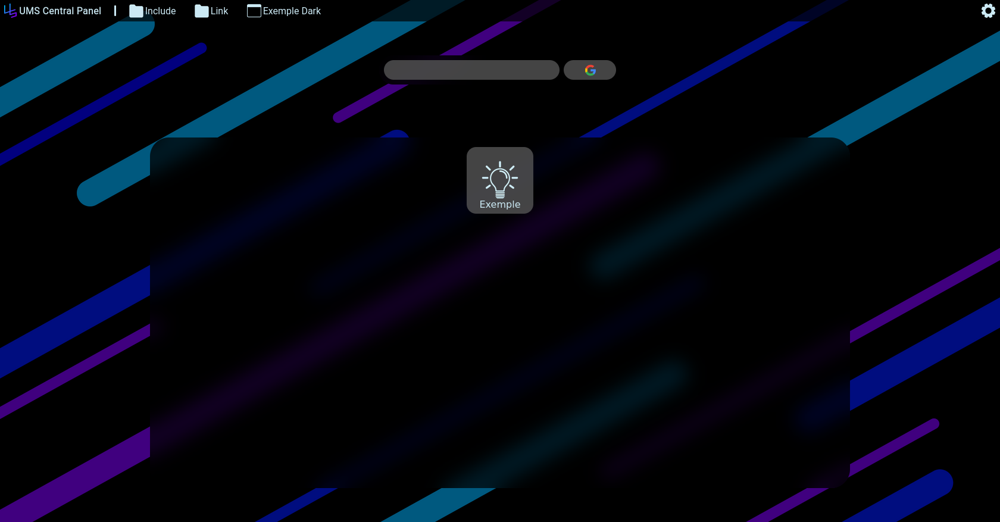
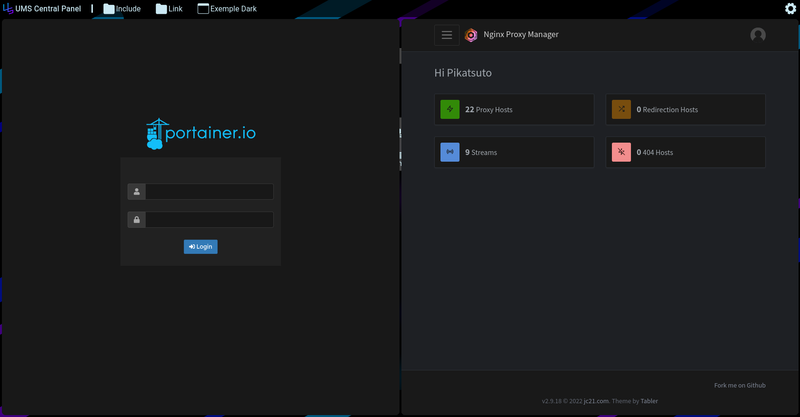

# UMS CD Central Panel

[](https://github.com/UMS-CD/UMS-CD-Installer/blob/main/LICENSE)

> ## [](https://github.com/Pikatsuto) [Gabriel Guillou](https://github.com/Pikatsuto)

> ## <a href="https://github.com/mathias-tavernier-roux"></a> [Mathias](https://github.com/mathias-tavernier-roux)

[README_FR 🇫🇷](README_FR.md)

## Full deployment in the blink of an eye

## Description:
> Admin Control Panel is a centralized admin panel for all your
> interfaces. It contains by default WebTerminal, Nginix Proxy Reverse,
> Portainer, Dozzle and 2 links to Freenom and CloudFlere

## Aventages:

### Simple:
> This is a simple interface to edit because it is only composed of
> A json file to define the list of panels and their mode

### Centralized:
> This interface allows you to centralize all the panels
> under a splitable tab system on a single screen

## Screen





## Start command

```bash
bash start.sh
```
